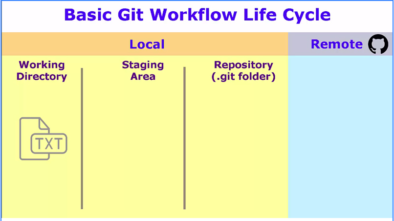

# Git Notes

## Ways to create a repo

Create a new repository:

```
git clone [repository-address.git]
cd new_folder
touch README.md
git add README.md
git commit -m "initial commit"
git push -u origin master

```

Create via existing folder:

```
cd existing_folder
git init
git remote add origin [repository-address.git]
git add .
git commit -m "initial commit"
git push -u origin master
```

Create via existing repository

```text
cd existing_repo
git remote rename origin old-origin
git remote add origin [repository-address.git]
git push -u origin --all
git push -u origin --tags
```


Remember to ensure your git config reflects the email address associated with your GitHub account otherwise contributions will not be reflected in profile contributions graph.

[https://help.github.com/en/articles/why-are-my-contributions-not-showing-up-on-my-profile](https://help.github.com/en/articles/why-are-my-contributions-not-showing-up-on-my-profile)


Ensure your config is up to dated with the correct info

```text
git config --global user.name "user name"
```

```text
git config --global user.email "user email address
```

### Stages of Changes



#### Working Directory

Files that have not been added or staged. These are known as untracked files.

#### Staging Area

Files that have been added for a commit.

#### Repository

Files that have been staged and committed.

### Listing Tracked Files

List the tracked files within a repository

```text
git ls-files
```

### Backing out of untracked changes

In the event you have made changes that have not been added or committed and you no longer wish to keep such changes

```text
git checkout -- .
```

```text
git checkout -- path/filetorevert
```


