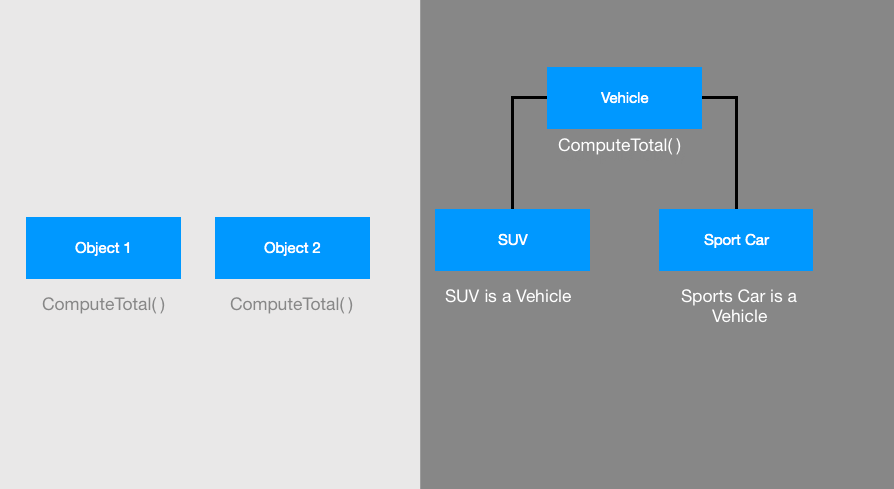
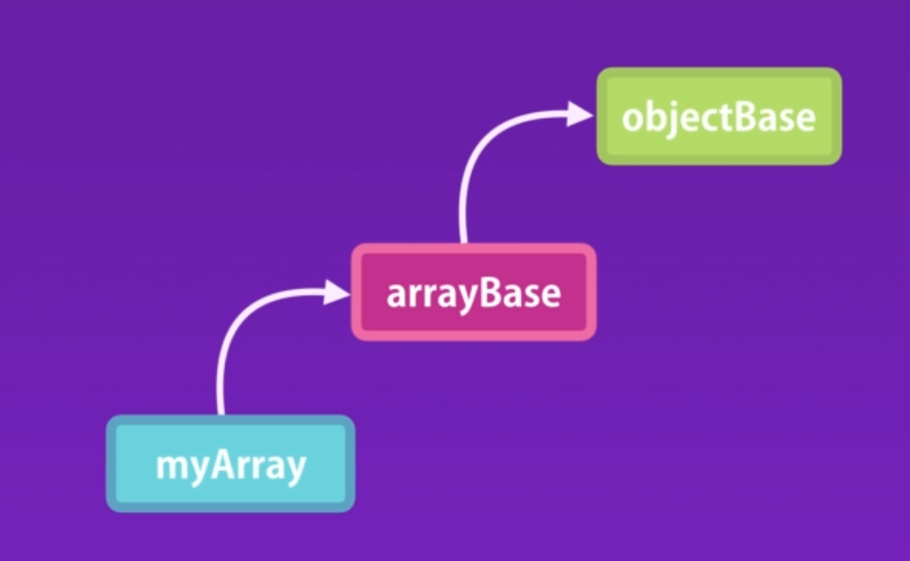

# Inheritance

## The corner stone of re-usability

Inheritance is one of the core concepts of oop that enable children objects to take on the properties and methods of parent objects. Because of inheritance, code can be reused as demonstrated in the following examples.

### Classical inheritance

Rather than have objects with identical properties and methods, we can have children objects inherit methods and properties from a parent object. This example illustrates inheritance via object classes.



### Prototypical inheritance


In JavaScript we do not have classes, we only have objects. However the same principal of inheritance can work because of the _**prototype.**_

Every object in JavaScript has a prototype or parent except the _**root object.**_


**We can identity what the prototype of an object is:**

```text
Object.getPrototypeOf(obj) //this reflect what Object.__prototype__ would return
```



> #### So when we use a constructor to create objects, that constructor creates a prototype all object instances will inherit.


If we were to inspect each of these objects, we would notice a property called _**\_\_proto\_\_**_ which would list the inherited properties and methods. Although _**\_\_proto\_\_**_ is the property the inspector displays, we DO NOT use this property to make use of the prototype. 


#### Prototype Constructor

```text
Obj.prototype 
```

We saw above that _**\_\_prototype\_\_**_ returns the parent object with all inherited properties and methods.

Obj.**prototype** is the property used to represent the parent object created when the function constructor is used.

