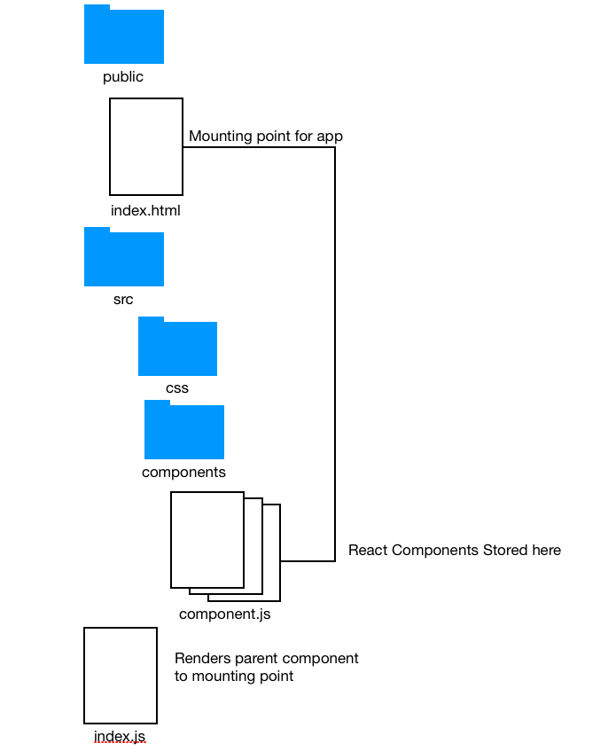

# Organization of React App

Because our React app consists of interdependent components, we build and save these components as separate files. The parent file with the render function references the React components we create for the applications and "renders" them to the "mounting point".

