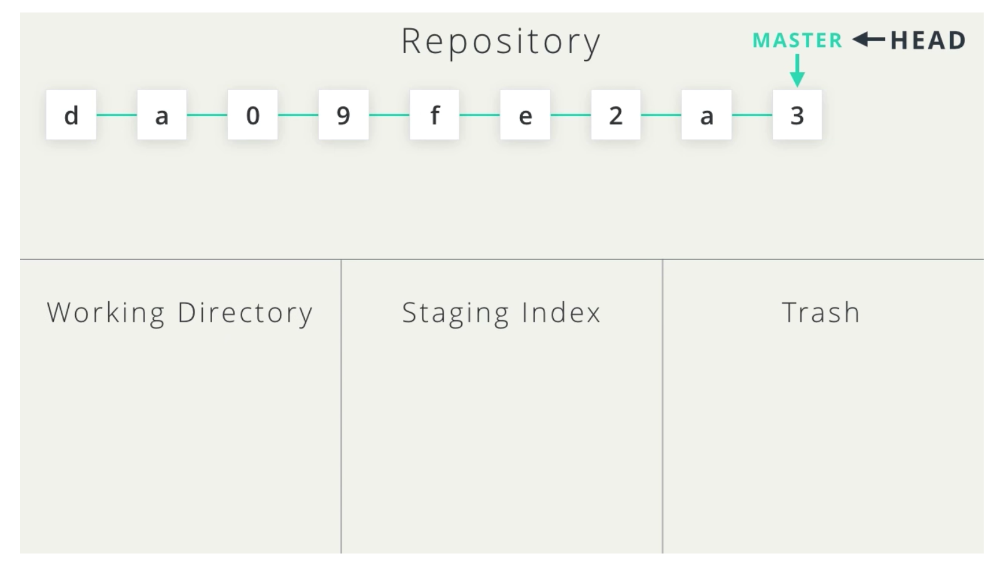
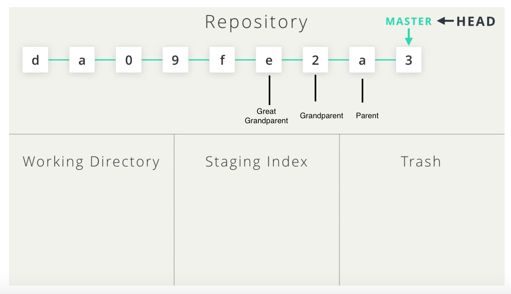
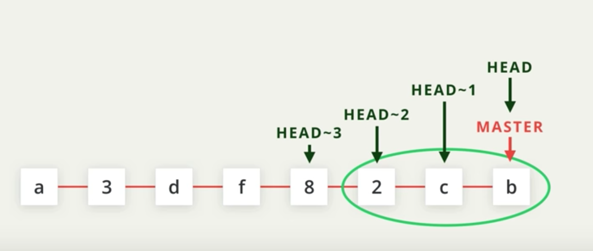

# Backing out of Commits

## Really...we can do this?

Yes, and there are a series of tools at our disposal for different scenarios.

### Alter the most recent commit

In the event we forgot to include a change or made a typo in the commit message

`git commit --amend`

#### How it works

You can run this command if your working directory is clean and there are no uncommitted changes.

* Edit the files or add files if you missed changes
* Save the files
* Stage the files
* Run `git commit --amend`

### Reversing the changes of a commit

In the event we want to revert the changes of commit. In other words, we are literally reversing the changes made by a particular commit.

`git revert <SHA of the commit we are targeting to revert>`

#### How it works

* Use git log to identify the commit you want to revert
* `git revert SHA of commit`


Note that this command creates a new commit in the commit history


### Git Reset 


Danger! Use with caution since you are literally removing commits from the repository.


In this scenario, we are removing commits from the git commit history. Because of this, we must use this command with caution.

```text
git reset <reference-to-commit>
```

When git reset is run, you do so with 1 of 3 flags. The flag specified determines the manner the commit is deleted.

* `--mixed` //default 
* `-- soft` 
* `-- hard`



In the example illustrated above, the following command would send the most recent commit back to the working directory

```text
git reset --mixed Head~1
```

In the example illustrated above, the following command would send the commit back to the Staging Index

```text
git reset --soft Head~1
```

In the example illustrated above, the following command would send the commit back to the trash

```text
git reset --hard Head~1
```

### Recommendation when using reset


It is recommended that you back up the branch you are working on using the backup command.


```text
git branch backup
```

### In the event a commit is sent to trash mistakenly

This scenario should be avoided at all costs. In the event a mistake is made, `git reflog` can be used to retrieve a history of deleted commits ~ for about 30 days.



### HEAD

Head refers to the last commit in the current checked-out branch.

### Targeting Commits

We can target commits by their **SHA**, by **tags**, **branches**, and the special `HEAD` pointer. Commits can also be targeted by there position relative to other commits using "_**Ancestry References**_"

`^` - indicates the parent commit

`~` - indicates the first parent commit

To clarify, the main difference between ^ and ~.

A merge has two parents,. With a merge commit, the ^ references the first parent of the commit while ^2 indicates the second parent. 

1. The first parent is the branch you are on when you run `git merge`
2. The second parent is the branch that was merged in

The following commits can be referenced in numerous ways:

#### Parent Commit

* HEAD^
* HEAD~
* HEAD~1

#### Grandparent Commit 

* HEAD^^
* HEAD~2

#### Great Grandparent Commit 

* HEAD^^^
* HEAD~3


Even with these definitions and additional reading i am still somewhat unclear on identifying commits relatively using ^ and ~.




If we wanted to reset and go back to **commit e**

```text
git reset --mixed Head~3
```



Head~\# seems to be a straightforward method of identifing the needed commit in a linear pattern.

```text
Head~#
```

