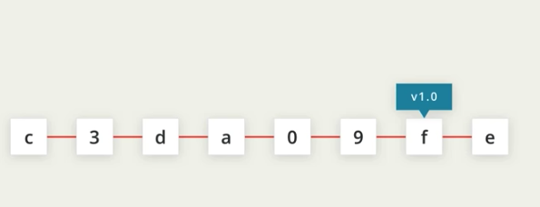

# Tags

## What are tags for?

Tags let us identify specific commits that may be of certain importance and allow us to label them



Tags stays locked to a commit throughout the commit history. You can however edit or remove tags if necessary.

### Adding a Tag

```text
git tag -a v1.0
```


it important to not forget to include the -a flag. -a tells Git to create an annotated flag. Without the flag, Git will create a lightweight tag and this is not as useful.

**Annotated flags provide the following pieces of information:**

* the person who made the tag
* the date the tag was made
* a message for the tag

This command will open git terminal in your editor \(as long as configuration has been set\).

_Type in the message for tag._


### Verify Tag was created

```text
git tag // will confirm the tag title you created the tag with

git log --decorate // will show the log with tags
```

### Deleting a Tag

```text
git tag -d v1.0
```

This method of tagging works for tagging the current commit. But is it possible to tag old commits.

### To Tag a previous commit

```text
git tag -a v1.0 a87984 //Provide the SHA of the commit you want to tag
```

