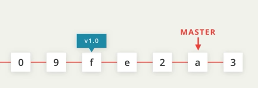
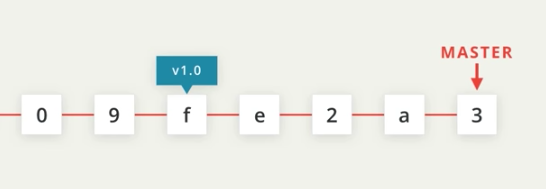
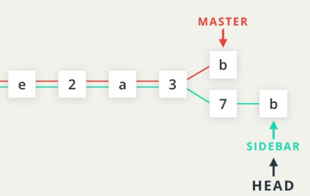

# Branching

## Our default branch - Master

Master branch is the default branch set up by Git. This happens automatically when we initialize a folder using the `git init` command.





### Branches are incredibles powerful 

They allow us to work on the same project in different isolated environments

In this example we have 2 branches. Currently they point to the same commit but make notice of the "_**Head**_" pointer. Head identifies the active branch. We can use the `git checkout` command to select the branch we want to actively work out of.


In this example, we see that we have switched to the sidebar branch and have made 2 commits.



### Creating Branches

We can create branches based on any commit in the commit history. When a branch is typically created, we create the branch from the most recent commit.

```text
git branch [branchname] //create a branch from most recent commit or head

git branch [branchname] [commit SHA] //create branch from a previous commit

```

### Deleting a Branch

When a branch is no longer needed, we can delete the branch using the -d flag

```text
git branch -d [branchname]
```

