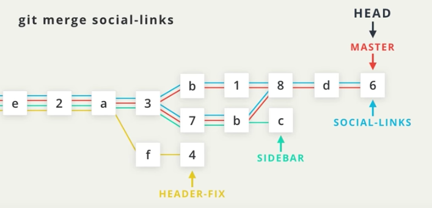

# Merging

## Types of Merges

There are two main types of merges, a "_**Regular merge"**_ and a "_**Fast-forward merge".**_


When a merge happens, it creates a commit, a _**"merge commit"**_


### Regular Merge

### Fast-forward Merge

In this scenario, the social-links branch is ahead of the master branch by two commits. If the social-links branch is merged into the master branch, a Fast-forward merge occurs.

### Performing a merge


Know what branch you are in. This is important because you are making a commit.


### Understand what branch you want to merge into what branch. 

This saying may help with identifying this. For example say we want to merge the new **prepaidPricing** branch into **master**.


I want to merge in the **prepaidPricing** branch


To execute. Simply checkout master branch. Now enter the command `git merge prepaidPricing`


### Interesting take away. Once we merge two branches together, you will notice that both branches point to the same commit.



When we execute a normal merge, two divergent branches are combined so a commit is going to be made. When a commit is made, a commit message needs to be supplied. Merge commits have a default message supplied. The message can be changed if desired, but it is common practice to use the default merge commit message.


