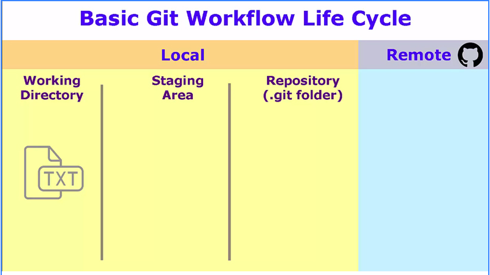

# Overview

## Visualizing the Git Workflow

Once we initialize a folder with the "_**init git**_" command, git begins watching the files in our local directory or "**working directory**". The working directory is the actual directory on your local machine you are working out of. Files that reside in your working directory are not yet tracked by Git.

The following illustration will help us visualize the less physical areas files are pushed through during the Git workflow.



Changes made within the working directory as not yet "tracked" until they are added to the "staging area or staging index". 

```text
git add . // will move files to staging index
```

Changes are now ready to be committed. 

```text
git commit
// ensure you have bash terminal to open in
// code editor or this command will open Vimm

or 

git commit -m "commit message"
```

Once changes are committed, we can view them in the commit history using

```text
git log // See Viewing Commits section for more info on this.
```


**The goal is that each commit has a single focus.**

\*Keep each commit short \(less then 60 characters\)

To ensure your commits are helpful, try using this phase:

This commit will...&lt;commit message&gt;

Also helpful is to write your commit messages with clarity


### Seeing changes that have not yet been committed

Changes that have not yet been committed are untracked. If we are working on a project and want to see _**what changes have been made but not yet committed**_, this command will be especially helpful.

```text
git diff
```

