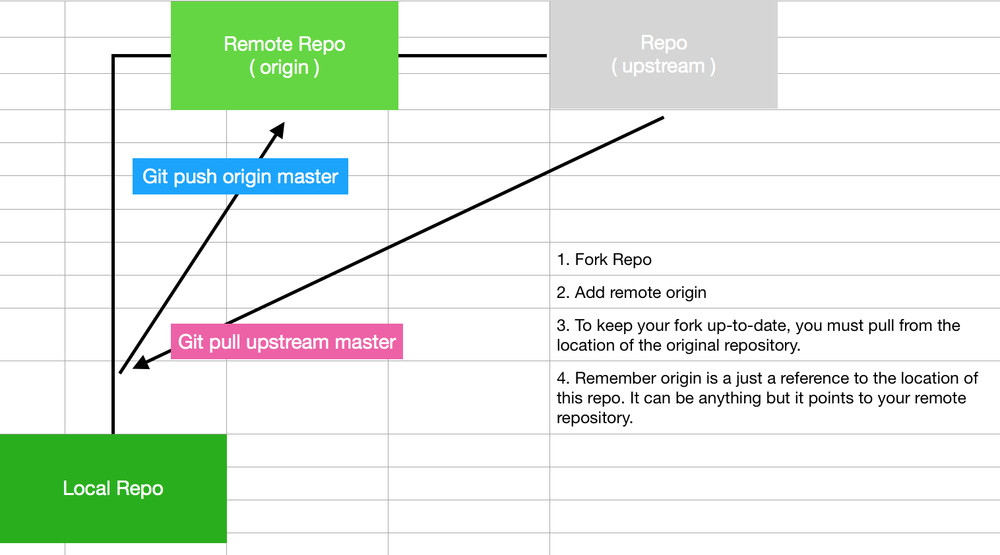

# Forks

## Setting up

When working with works you need to set up your upstream. Remember once you fork the repository and clone that repo to your local - that local refers to your fork as "origin master". _**If you want to ensure you keep your fork updated with the updates made to it from other devs you need to connect your fork to the origin repository.**_

```
git remote add upstream <github url of origin repository>
```




We can only **pull** from the _Upstream_. We can not push because we do not own that repository. To push to that repository we would need submit a **pull request** from our **remote** repository.


