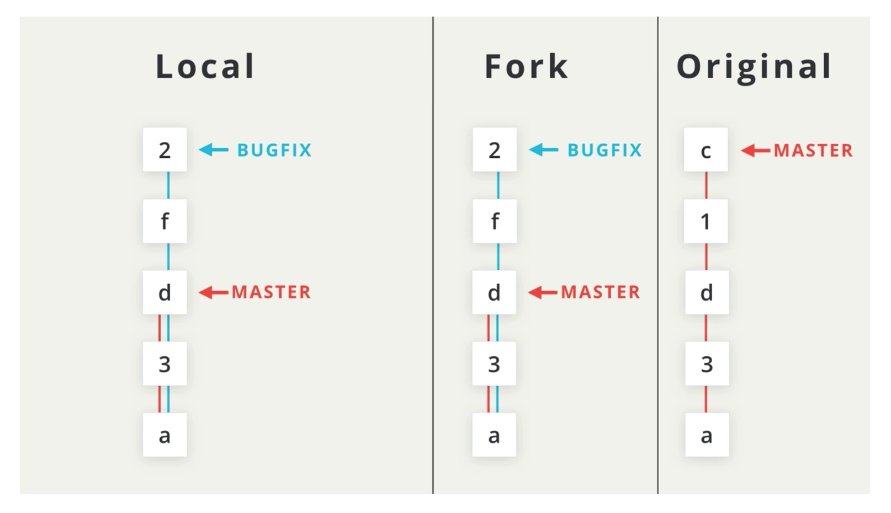
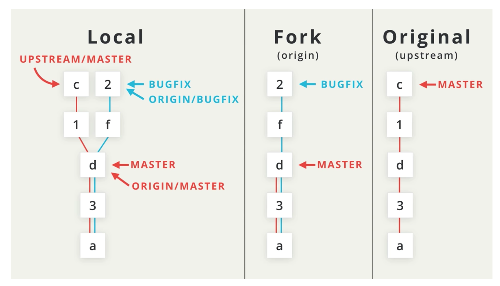
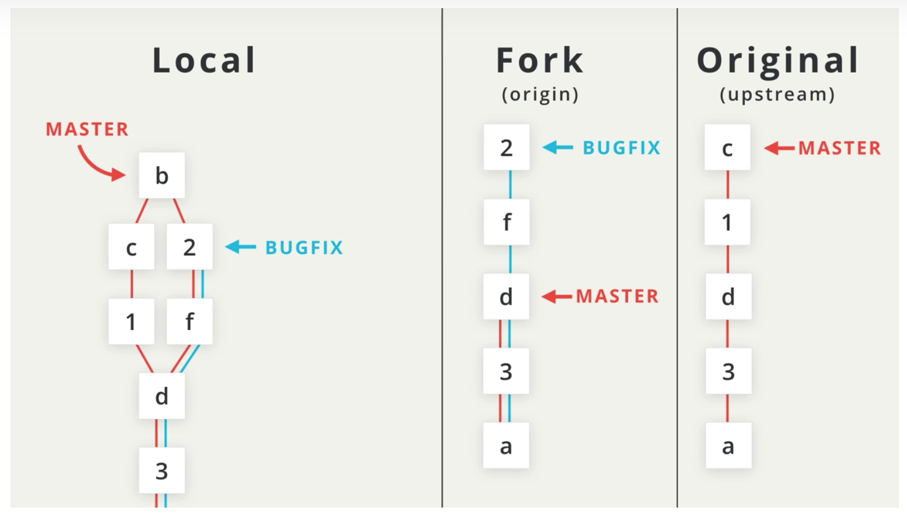

# Staying inSync

From the illustration we can see that we have _**forked**_  the original repository. We cloned our forked version to our local. 

1. We have made a bug fix to our local and pushed those changes to our fork.
2. Since we initially forked the repository, additional commits have been made on the original. Now our forked version and original both have commits neither repository have.



### How to Sync to prepare for a pull request

```text
git fetch upstream master
```



The `fetch upstream` command pulls in the commits from the **upstream**

Merge the commits, you are now ready to submit pull request.



