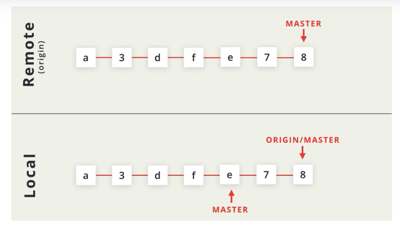
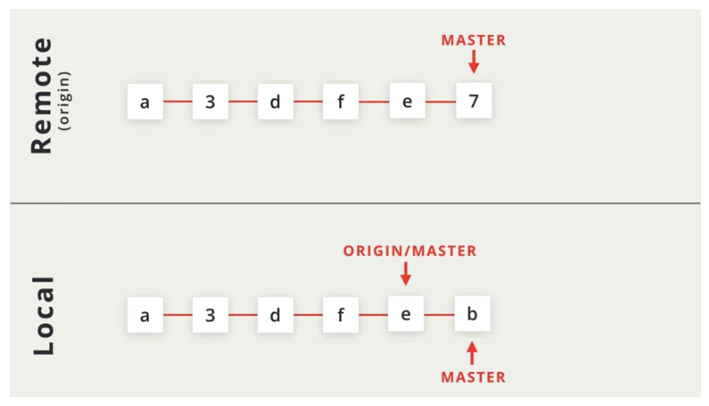
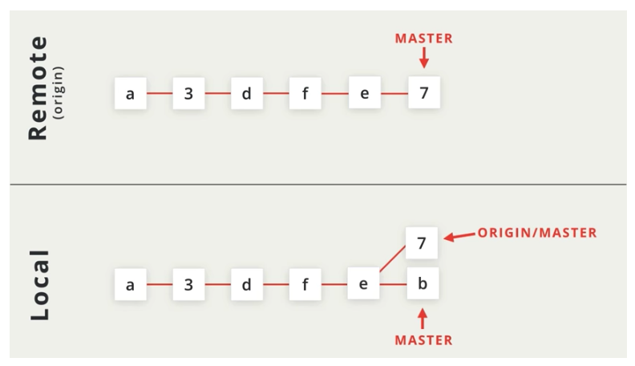
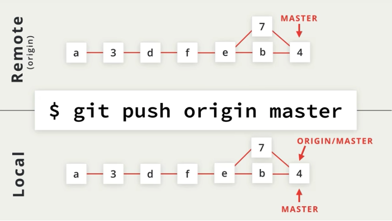

# Fetch

Git fetch retrieves commits from a remote branch but it does not automatically merge the branch 

### Why use `git fetch`

If you do not want to automatically merge the local branch with the tracking branch. 


We would likely want to do this in the event there are commits in the remote repository that are absent from the local and there are also commits in the local repository that are absent from the remote.


git fetch does the following:

1. The commits from the remote branch are copied over to the local repository
2. The local tracking branch \(origin master\) is moved to point to the most recent commit


**But NOTE that the local branch DOES NOT change at all.** 


### Scenario

Remote and local repositories both have commits neither one has. Note that each repository master is pointing to it's latest commit.

To solve this, lets first run a `git fetch origin master`. This will pull in the commits from the remote repository and have tracking point to them \(origin master\).

Now we can do a manual merge using `git merge.` Once merged, a `git push origin master` will sync the repositories.

