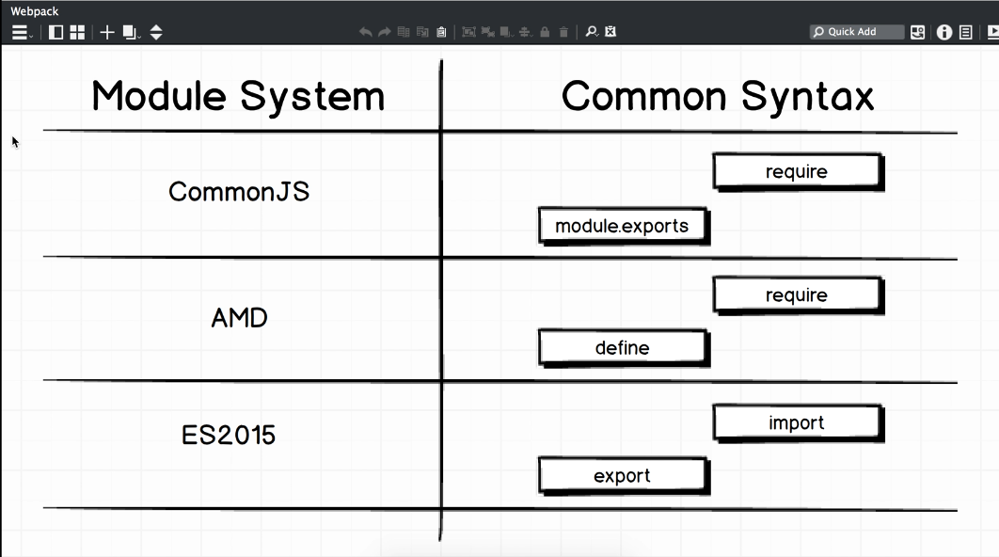

# webpack

### setting the context

With the advent of Single page applications, the architecture of how HTML documents are served from server to the client changed. This is in contrast to Server Side Rendering of HTML documents from server to client. In a Single page application world, we are relying on JavaScript to run on the client to assemble the entire web application. This means, there is a huge number of JavaScript files that are being sent to the client. As the code base grows so grows the complexity of managing the code base. As a consequence of these large JavaScript code bases, JavaScript Modules was introduced. Rather then manage large JavaScript code bases as a handful of very large files, JavaScript Modules aims at separating the code base into many small JavaScript files to more clearly organize the web application.   



In the above example, our web application is more clear in regard to where certain functionality will likely exist. _**But now we have to worry about the order in which are code is executed and the performance impact of loading so many files.**_


### what does Webpack solve?

The main purpose of Webpack is to gather the many separate JavaScript modules and bundle them into one large file while also ensuring each module is executed in the correct order.

### JavaScript Modules



### Common JS Modules

The following are rule sets for linking js files together using Common JS modules

```text
//statement to export code
const !variable = require('./relativePathtoFileName');

//statement to import code

module.exports = variable!
```

### ES2015 Modules

The following are rule sets for linking js files together using ES2015 modules. ES2015 modules is the more modern approach of JavaScript Modules.

```
//statement to export code
export default !variable;

//statement to import code

import !variable from './relativePathtoFileName';
```


